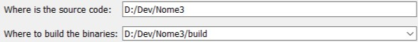

# Preparation
Nome 3 currently only supports Windows as it relies on Direct3D 11. This section will walk you through the steps for setting up a build environment for Nome 3 on Windows. Here is a list of the required dependencies:

- Visual Studio 2017 (https://visualstudio.microsoft.com/)
- CMake
- Flex/Bison
- Qt 5
- OpenMesh

To make your life eazier, there are a few package management software on Windows that I would personally recommend:
- Scoop (We need this for cmake)
- Vcpkg (We need this for OpenMesh and Qt5)
- Msys2 (For Flex and Bison)

Please install __Visual Studio__ first, as it is necessary for any development work on Windows. Then you can install __scoop__, __vcpkg__, and __msys2__; it should be straightforward. Go ahead and spend a few minutes playing with each package management tool. They will save you tons of time trying to pull together different C++ libraries, potentially in the future. Now you might be wondering why we need three different package managers. So I will explain: __scoop__ deals with applications, such as CMake and Python; __vcpkg__ is a C++ dependency manager from Microsoft that goes together with Visual Studio, and it concerns with libraries that we can `#include` from our own code. As for __msys2__, well, we don't really need it, but there is actually not an eazier way to install flex and bison on Windows so I opted for that.

Now hopefully you are familier with those package managers. Run the following commands (potentially in different directories depending on where you installed each package manager) to install what we need:

```
scoop install cmake
vcpkg --triplet x64-windows install qt5-base openmesh
pacman --needed -S bison flex
```

# Compilation
Open up the CMake GUI, and set it up like this:


Then click on "Add Entry" to add the following variables so that CMake can find all those libraries:
```
CMAKE_TOOLCHAIN_FILE = [Vcpkg dir]/scripts/buildsystems/vcpkg.cmake
FLEX_EXECUTABLE = [Msys2 dir]/usr/bin/flex.exe
BISON_EXECUTABLE = [Msys2 dir]/usr/bin/bison.exe
```

Now you can click on "Configure" and "Generate" to generate a Visual Studio solution file and open it with Visual Studio.

# Preparation and Compilation for Mac Users
This is a quick setup for new students working on Nome3 on Mac.
Go to your desired repository in your terminal and run the following command to add all the Nome3 files and required submodules.
```
https://github.com/cyj0912/Nome3.git --recursive
```

Nome3 requires the most recent version of its dependencies so run:
```
brew install qt
brew install open-mesh
brew install pugixml
brew install flex bison
brew install cmake
```
Finally, run the following commands:
```
cd Nome3
mkdir build && cd build
cmake .. && make
```
This will create a build folder, and compile and make Nome3. This may take a few minutes so wait until the make has completed. Once it has completed, navigate to `build/Application/Binaries`. In the Binaries folder there should be a Nome3 executable. Run this program and it will open up an untitled.nom preview. From the menu bar at the top of your screen run `File/Open` and select the .nom file you would like to run. You will now be able to see your .nom instance in a 3-D display!

This an example of running a simple cube .nom instance after following the steps above:


# Running
TBD
